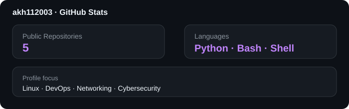

# 👋 Hi, I'm Akhil

### 💻 Computer Science Engineer | 🐧 Linux & DevOps Learner | 🔐 Cybersecurity Enthusiast

<p align="center">
  
</p>

---

## 🚀 About Me

<table>
<tr>
<td width="55%">

- 🎓 Computer Science Engineer
- 🐧 Passionate about **Linux & System Administration**
- 💻 Currently learning **Bash Scripting & Automation**
- ☁️ Exploring **DevOps, Cloud & AWS**
- 🔐 Interested in **Cybersecurity & Networking**
- 🛠️ Love building practical projects and solving problems
- 📚 Always learning something new

</td>
<td width="45%">

### 🎯 Currently Focusing On

```text
🐧 Linux Administration
💻 Bash Scripting
🌐 Networking Fundamentals
⚙️ DevOps & CI/CD
☁️ AWS & Cloud Basics
🔐 Cybersecurity Fundamentals
```

</td>
</tr>
</table>

---

# 🛠️ Tech Stack

### 🐧 Operating Systems

<p>


</p>

### 💻 Languages & Scripting

<p>


</p>

### ⚙️ DevOps & Tools

<p>


</p>

### ☁️ Cloud

<p>

</p>

### 🔐 Cybersecurity & Networking

<p>


</p>

---

# 🚀 Featured Projects

<table>
<tr>
<td width="50%">

### 🐧 Linux Command Handbook

A practical collection of commonly used Linux commands with examples and explanations.

**Tech:** `Linux` `Shell`

</td>
<td width="50%">

### 💻 Bash Scripting Collection

Beginner-to-advanced Bash scripting exercises and automation projects.

**Tech:** `Bash` `Shell`

</td>
</tr>
<tr>
<td width="50%">

### ⚙️ DevOps Toolkit

Useful scripts, configurations and automation tools for DevOps learning.

**Tech:** `Linux` `Bash` `DevOps`

</td>
<td width="50%">

### 🔐 Cybersecurity Lab

Hands-on cybersecurity learning, networking experiments and security notes.

**Tech:** `Linux` `Networking` `Security`

</td>
</tr>
</table>

> ⭐ Check out my repositories to see what I'm building.

---

# 📊 GitHub Stats

<p align="center">
  
</p>

---

# 📈 Contribution Graph

<p align="center">
  
</p>

---

# 🧠 Learning Roadmap

```text
Linux
  └── System Administration
        └── Bash Scripting
              └── Automation
                    └── DevOps
                          ├── Git & GitHub
                          ├── Docker
                          ├── CI/CD
                          └── AWS ☁️

Networking
  └── TCP/IP
        └── Network Security
              └── Cybersecurity 🔐
```

---

# 🎯 My Goals

- [ ] Become highly confident with Linux
- [ ] Master Bash scripting
- [ ] Build real-world automation projects
- [ ] Learn Docker & CI/CD
- [ ] Strengthen networking fundamentals
- [ ] Build practical cybersecurity projects
- [ ] Deploy projects on AWS
- [ ] Contribute to open-source projects

---

# 💡 Philosophy

> **"The best way to predict the future is to create it."**

### Keep Learning. Keep Building. Keep Growing. 🚀

---

# 🤝 Let's Connect

<p align="center">
<a href="https://www.linkedin.com/in/akhil112003"></a>
<a href="https://github.com/akh112003"></a>
</p>

<p align="center">
  <b>🐧 Linux • 🐍 Python • 💻 Bash • ⚙️ DevOps • 🌐 Networking • 🔐 Cybersecurity</b>
</p>

---

<p align="center">
  <i>Thanks for visiting my profile! ⭐</i>
</p>
